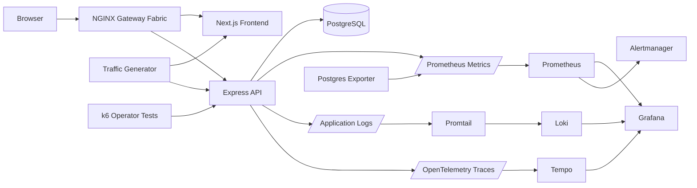

# Infrastructure and Monitoring in eBusiness

Master's thesis project focused on cloud-native infrastructure, observability, alerting, autoscaling, and load testing for an e-commerce workload.

The application in this repository is intentionally modest: a small electronics store with a frontend, backend, database, authentication, products, carts, and orders. Its main purpose is to act as a realistic workload for studying how an e-business system behaves once it is containerized, deployed to Kubernetes, instrumented, monitored, stressed, and observed through modern infrastructure tooling.

## Project Focus

This project is primarily about the infrastructure and monitoring layer around an application, not about building a production e-commerce platform.

It demonstrates:

- Kubernetes deployment of a multi-service application.
- Gateway-based routing for frontend and API traffic.
- Prometheus metrics collection from application and database services.
- Grafana dashboards for application, database, and Kubernetes visibility.
- Loki-based log aggregation with trace correlation.
- Tempo-based distributed tracing through OpenTelemetry.
- Alertmanager rules for availability, latency, resource pressure, failed logins, and database health.
- Horizontal autoscaling based on CPU utilization.
- Synthetic background traffic and k6 load-test scenarios for observability experiments.
- A repeatable Minikube deployment flow for local or remote demonstration environments.

## System Overview



The system is deployed as Kubernetes workloads in Minikube. The application traffic enters through NGINX Gateway Fabric using Gateway API resources. The backend exposes Prometheus metrics at `/metrics`, emits request/error logs, and participates in OpenTelemetry tracing. Prometheus, Loki, Tempo, and Grafana provide the main observability stack, while Alertmanager handles alert routing.

## Infrastructure Components

### Kubernetes Application Layer

The application manifests in `k8s/app/` define:

- PostgreSQL StatefulSet, service, persistent storage, and development secret.
- Backend Deployment and service on port `2000`.
- Frontend Deployment and service on port `3000`.
- Database seeder Job for Prisma schema creation and seed data.
- Traffic generator Deployment for continuous synthetic behavior.
- Gateway API `Gateway` and `HTTPRoute` resources that route `/api` traffic to the backend and all other traffic to the frontend.
- HorizontalPodAutoscalers for backend and frontend workloads.

The frontend and backend images are built locally into the Minikube Docker daemon and run with `imagePullPolicy: Never`, which keeps the deployment self-contained for thesis demonstrations.

### Gateway and Routing

The project uses Kubernetes Gateway API with NGINX Gateway Fabric instead of a traditional Ingress resource.

Routing behavior:

- `/api/*` requests are sent to the backend service.
- `/` and frontend routes are sent to the frontend service.
- The frontend uses a same-origin API URL in Kubernetes, allowing the Gateway to route browser API calls without exposing a separate backend URL.

### Autoscaling

The backend and frontend each have a HorizontalPodAutoscaler:

- Minimum replicas: `1`
- Maximum replicas: `7`
- CPU utilization target: `55%`
- Scale-up stabilization window: `30s`
- Scale-down stabilization window: `90s`

This allows load-testing scenarios to demonstrate how Kubernetes reacts to changing traffic levels and resource pressure.

## Observability Stack

### Metrics with Prometheus

The backend uses `prom-client` to expose default Node.js metrics and custom application metrics.

Custom metrics include:

| Metric | Type | Purpose |
| --- | --- | --- |
| `http_requests_total` | Counter | Counts requests by method, route, and status code. |
| `http_request_duration_seconds` | Histogram | Tracks request latency by method and route. |
| `http_errors_total` | Counter | Counts HTTP errors by method, route, and status code. |
| `login_attempts_total` | Counter | Tracks successful and failed login attempts. |
| `db_query_duration_seconds` | Histogram | Measures Prisma query duration by operation. |
| `db_queries_total` | Counter | Counts successful and failed database operations. |

The backend is scraped through a `ServiceMonitor` every 15 seconds. PostgreSQL metrics are collected through Postgres Exporter, also scraped by Prometheus.

### Dashboards with Grafana

Grafana is provisioned through kube-prometheus-stack and configured with datasources for:

- Prometheus for metrics.
- Loki for logs.
- Tempo for traces.

The repository includes a Grafana dashboard ConfigMap that visualizes service-level behavior such as pod availability, resource usage, request volume, latency, error rate, and database-related signals.

### Logs with Loki and Promtail

The backend logs request events with:

- Timestamp
- HTTP method
- URL
- Status code
- Duration
- Trace ID when available

Promtail runs as a DaemonSet and forwards Kubernetes pod logs to Loki. The Loki datasource includes a derived trace field that extracts `trace_id=<id>` from log lines, making it possible to jump from logs to traces in Grafana.

### Traces with OpenTelemetry and Tempo

The backend Deployment is annotated for OpenTelemetry Node.js auto-instrumentation:

```yaml
instrumentation.opentelemetry.io/inject-nodejs: "true"
```

An OpenTelemetry `Instrumentation` resource exports traces to Tempo using OTLP HTTP. Tempo is configured with metrics generation for service graphs and span metrics, remote-writing those generated metrics back to Prometheus.

The backend also creates an explicit span around bcrypt password comparison, making authentication behavior visible in traces.

## Alerting

Alerting is managed through PrometheusRule resources and Alertmanager.

The rules cover:

- Backend high CPU usage.
- Backend high memory usage.
- Backend pod availability.
- Backend desired replica mismatch.
- High HTTP error rate.
- High API response time.
- High failed login rate.
- Frontend high CPU usage.
- Frontend high memory usage.
- Frontend pod availability.
- Frontend desired replica mismatch.
- PostgreSQL availability.
- Database disk usage.
- Database deadlocks.
- Database operation errors.
- Node CPU pressure.
- Node memory pressure.
- Pod restarts.
- Unavailable Kubernetes deployments.

Alertmanager email routing is templated through `k8s/monitor/components/alertmanager-config.example` and converted into a Kubernetes secret during clean deployment.

## Load and Experiment Design

The repository includes two traffic sources: a continuous traffic generator and operator-driven k6 tests.

### Continuous Traffic Generator

The traffic generator runs inside Kubernetes and continuously simulates application behavior. It creates a mix of normal and intentionally problematic traffic, including:

- User registration.
- Successful login.
- Failed login.
- JWT validation.
- Product listing and product detail requests.
- Order creation.
- Order lookup.
- Invalid-token requests.
- Frontend page requests.
- Requests to invalid paths.
- Periodic spikes.
- Time-of-day traffic shaping.

This creates a constant stream of data for dashboards, logs, traces, and alerts.

### k6 Scenarios

The `load-testing/k6/` folder contains explicit test scenarios for controlled experiments:

| Scenario | Purpose |
| --- | --- |
| `constant-load.js` | Sustained catalog browsing and occasional login traffic. |
| `fail-login.js` | Repeated invalid login attempts to validate authentication-related alerting. |
| `mixed-load.js` | Weighted browsing, authentication, order, and frontend traffic with ramping virtual users. |
| `order-flow.js` | End-to-end signup, login, browsing, order creation, and order retrieval. |

The k6 runner creates a ConfigMap and a `TestRun` custom resource for the k6 Operator in the `monitoring` namespace.

## Demonstration Deployment

The main demonstration entrypoint is:

```bash
./k8s/deploy.sh --clean
```

In a clean run, the script:

1. Recreates the Minikube cluster.
2. Enables the metrics server.
3. Builds all application Docker images.
4. Installs required Helm repositories.
5. Installs cert-manager.
6. Installs the OpenTelemetry Operator.
7. Installs Gateway API and NGINX Gateway Fabric.
8. Deploys the application workloads.
9. Installs kube-prometheus-stack.
10. Installs Loki and Tempo.
11. Installs the k6 Operator.
12. Applies Grafana datasources, dashboards, ServiceMonitors, alerts, Promtail, Postgres Exporter, and NodePort helper services.

Before a clean deployment, an Alertmanager config file is expected at:

```text
k8s/monitor/components/alertmanager-config
```

It can be created from the example file:

```bash
cp k8s/monitor/components/alertmanager-config.example k8s/monitor/components/alertmanager-config
```

For a remote demonstration host, `k8s/deploy-to-remote.sh` packages the repository, copies it to a target server, installs dependencies, runs the clean deployment, and opens SSH tunnels for the exposed services.

## Exposed Demonstration Services

The deployment creates NodePort helper services for the main demonstration surfaces:

| Service | URL |
| --- | --- |
| Application gateway | `http://$(minikube ip):32003` |
| Grafana | `http://$(minikube ip):32000` |
| Prometheus | `http://$(minikube ip):32001` |
| Alertmanager | `http://$(minikube ip):32002` |

Grafana credentials are configured as:

```text
Username: admin
Password: admin
```

## Application Workload

The application exists to generate realistic e-business signals for the monitoring system.

It includes:

- A Next.js electronics storefront.
- Product catalog browsing.
- Cart management.
- Signup and login.
- JWT-protected order creation.
- PostgreSQL persistence through Prisma.
- Seeded product and user data.

Seeded demo credentials:

```text
Email: user1@example.com
Password: password123
```

The backend exposes endpoints for users, products, orders, uploaded product images, and Prometheus metrics. The details of the application are intentionally secondary to the infrastructure behavior it produces.

## Technology Used

### Application

- Next.js
- React
- TypeScript
- Tailwind CSS
- shadcn/ui
- Express
- Prisma
- PostgreSQL
- JWT authentication

### Infrastructure and Monitoring

- Docker
- Minikube
- Kubernetes
- Helm
- NGINX Gateway Fabric
- Kubernetes Gateway API
- Prometheus
- Grafana
- Alertmanager
- Loki
- Promtail
- Tempo
- OpenTelemetry Operator
- Postgres Exporter
- k6 Operator

## Repository Map

```text
backend/                         Express API, Prisma schema, seed data, metrics instrumentation
frontend/                        Next.js storefront used as the e-business workload
docker/                          Dockerfiles and Minikube image build script
k8s/app/                         Application, database, gateway, seeder, traffic, and autoscaling manifests
k8s/monitor/components/          Alerts, dashboard, OpenTelemetry, Promtail, Postgres exporter, Alertmanager template
k8s/monitor/datasource/          Grafana Loki and Tempo datasource provisioning
k8s/monitor/helm/                Helm values for monitoring components
k8s/monitor/port-forward/        NodePort helper services for demos
k8s/monitor/service-monitor/     Prometheus ServiceMonitor resources
load-testing/k6/                 k6 test scenarios and TestRun helper script
load-testing/traffic-generator/  Continuous synthetic traffic generator
```

## Notes

- This repository is a thesis/demo environment, so development onboarding and contribution workflows are intentionally not emphasized.
- Kubernetes secrets in the manifests use local demonstration defaults and should not be treated as production credentials.
- The frontend uses a same-origin API URL in Kubernetes so Gateway API can route browser requests to the backend.
- The traffic generator deliberately creates failed and invalid requests so dashboards and alerts have meaningful error signals.
- `docker/build.sh --deploy` references an `ingress.yaml` path, while the main deployment uses Gateway API through `k8s/app/gateway.yaml`; `./k8s/deploy.sh --clean` is the primary demonstration path.

## Thesis Objective

The objective of this project is to show how a typical e-business workload can be deployed and observed through a cloud-native monitoring stack. The small store application provides realistic traffic, authentication, database access, errors, latency, and order flows. The main contribution is the infrastructure around it: automated deployment, metrics, logs, traces, dashboards, alerts, autoscaling, and load generation that together make the system measurable and explainable.
